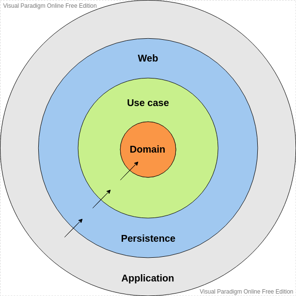

# YOUR MONEY
Your Money is an app to help people control their financial lives. The goal is to provide you with a way to organize your income and expenses your way.  
It is being developed as an artifact of Alura's backend programming challenge.  
Read more about [here](https://www.alura.com.br/challenges/back-end-4/semana-01-implementando-api-rest)
## Requirements
- Java Development Kit >=11;

## Project structure
I tried to apply in the project structure some [Clean Architecture](https://8thlight.com/blog/uncle-bob/2012/08/13/the-clean-architecture.html) practices aiming to develop an easily testable code, with loosely coupled modules and that supports the inclusion of new features efficiently.

The project has the following modules:
* `domain`: Owns all application domain objects;
* `usecases`: It has the entire business rule of the service;
* `persistence`: Implementation of the data layer where the data access interfaces defined by the use case layer are implemented;
* `web`: Layer that exposes API endpoints as a web service;
* `application`: Module that connects all other modules of the architecture and starts the application.

### Diagram of dependencies between modules



## API Documentation

### Incomes

```
POST /receitas - Create an income.
```
#### Request payload
```json
{
  "amount": 1002,
  "description": "Donation",
  "date": "2022-09-03"
}
```
#### Response 201
```json
{
  "amount": 1002,
  "description": "Donation",
  "date": "2022-09-03"
}
```   

#
```
GET /receitas?descrition - List all incomes found.
```
| Parameter   | Type       | Required  | Description                  |
| :---------- | :--------- |-----------|:-----------------------------|
| `descricao` | `String` | **false** | Income description to search |


#### Response 200
```json
[
  {
    "amount": 1002,
    "description": "Donation",
    "date": "2022-09-03"
  },
  {
    "amount": 5000,
    "description": "Donation 2",
    "date": "2022-08-01"
  }
]
```
#
```
GET /receitas/${id} - Get the income from the given ID
```
| Parameter | Type       | Required | Description |
|:----------| :--------- |----------|:------------|
| `id`      | `String` | **true** | Income ID   |

#### Response 200
```json
  {
    "amount": 1002,
    "description": "Donation",
    "date": "2022-09-03"
  }
```
#
```
GET /receitas/{year}/{month} - List all incomes found in the given month.
```
| Parameter | Type      | Required | Description         |
|:----------|:----------|----------|:--------------------|
| `year`    | `Integer` | **true** | Year of the income  |
| `month`   | `Integer` | **true** | Month of the income |


#### Response 200
```json
[
  {
    "amount": 1002,
    "description": "Donation",
    "date": "2022-09-03"
  },
  {
    "amount": 5000,
    "description": "Donation 2",
    "date": "2022-08-01"
  }
]
```


#
```
  PUT /receitas/${id} - Update an income
```
| Parameter | Type       | Required | Description |
|:----------| :--------- |----------|:------------|
| `id`      | `String` | **true** | Income ID   |

#### Request payload
```json
  {
    "amount": 50,
    "description": "Donation",
    "date": "2022-09-03"
  }
```

#### Response 200
```json
  {
    "amount": 50,
    "description": "Donation",
    "date": "2022-09-03"
  }
```


#

```
DELETE /receitas/${id} - Delete an income
```
| Parameter | Type       | Required | Description |
|:----------| :--------- |----------|:------------|
| `id`      | `String` | **true** | Income ID   |

**Return - Status 204 No Content**
#
